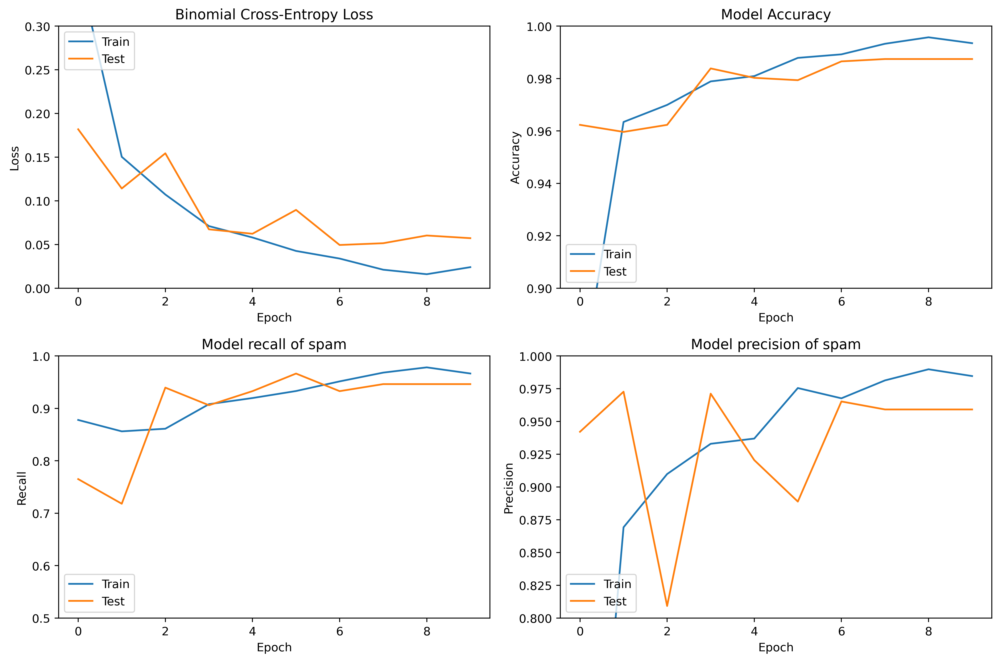
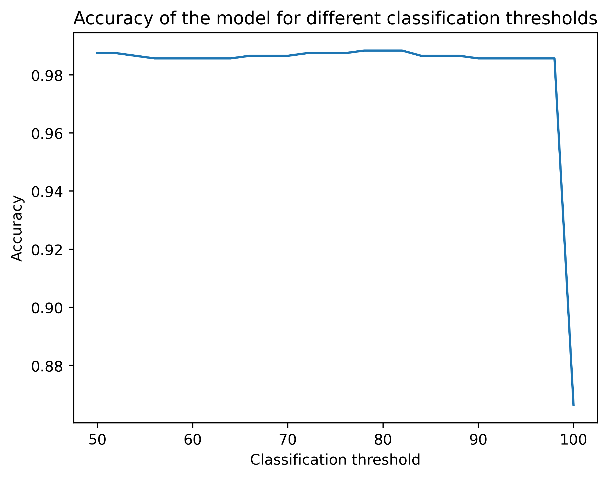
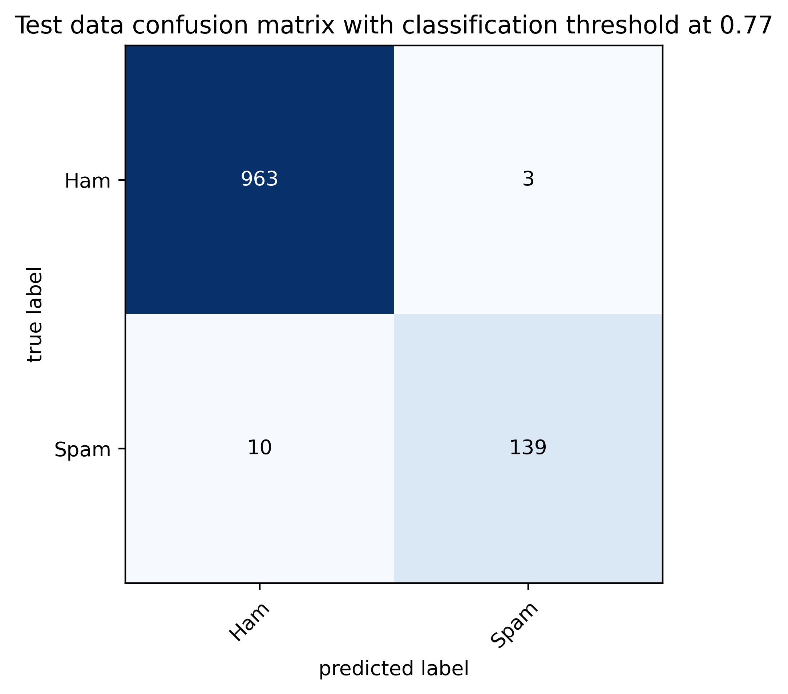
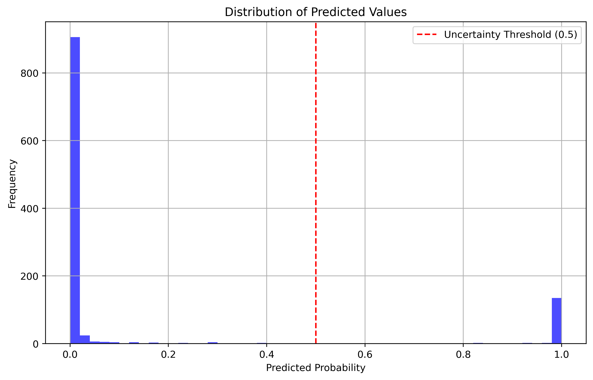

# Email Anti-Spam Learning
## Contents:
---
[Aims and the question](https://www.example.com)\
[Obtaining the dataset](https://www.example.com)\
[Data Cleaning](https://www.example.com)\
[Building and Optimising testing models](https://www.example.com)\
[Conclusions](https://www.example.com)

## Aims and the Question:
---
This mini-project is mainly used as an exercise to learn more about Programming practices for machine learning, as well as to familiarize myself with various types of standard neural networks. I was inspired to work on this project after seeing a similar project done by user rgdavies92 (project link at the end). I specifically used a basic linear regression model, as well as RNNs of different structures. I would also be trying to use extensions such as tensorboard, as well as external data like the GloVe word embeddings to improve my model. As this is one of my first few projects, I am mainly looking to just try out various tools that may help me out in the future. 

The primary aim was to build a model that can be used to determine whether or not an email is spam or not. While for more specific environments we may want to pursue a specific metric such as false positifve rate (to prevent non-spam emails from being classified as spam), we have no such needs so we would simply look at the accuracy of the model. 

## Obtaining the dataset
---
In this project I have chosen two different datasets to train different models. For simplicity, both datasets were lifted from kaggle. For the first, I have used a dataset that contains the count for each word that appears in the email rather than the messages itself ([link](https://www.kaggle.com/datasets/balaka18/email-spam-classification-dataset-csv)). For my second datasetm, I have used the same dataset as rgdavies92, which is a simple pre-made dataset from [kaggle.com](https://www.kaggle.com/datasets/team-ai/spam-text-message-classification), consisting of 5157 unique text messages. 12% of the messages are labelled as spam, leaving the remaining 88% as 'ham'. Although these are specifically text messages rather than emails the content is similar enough for the purposes of this project. I will be referring to these datasets as dataset1 and dataset2 respectively throughout this document.

## Data Cleaning
---
For context, I have tried two different approaches to this problem. First is by finding the top 3000 most common unique words across all the email examples, and assigning using the count for each word to train the neural network. While this is a relatively naive method with somewhat obvious flaws, it is a good starting point to check what the baseline of the model is. As the first dataset is already in the required form, close to no cleaning was required. Applying this method to dataset2 does require a bit or organizing, essentially first finding the most common words, iteratively counting how many of each are in the datasets, and appending the count for each word to the old dataset in a new column. For the second approach (only applied to dataset2), I've utilized various RNN structures to build a classification model. As there are only two columns, 'Category' and 'Message, there is little to no data cleaning required. Simply removing duplicates is sufficient for now as the punctuation and text cases will be standardised as part of the workflow. 

## Building and optimising testing models
---
### Approach 1:
For my first approach, the workflow to be implemented is as follows:
- Obtain a list of unique words appearing in the dataset
- iteratively count the number of appearences of the words in each email and append to the dataframe
- Insert the data into a simple Sequential model with only dense layers

### Approach 2:
The workflow for my second approach is as follows:
- Use label_encoder, pad_sequences and tokenizer to transform the data into the form we need
- input the data into three different RNNs:
1. Simple RNN with an embedding layer, Bidirectional LSTM layer, and a Dense output layer
2. Slightly more sophisticated RNN with an embedding layer, and two LSTM layers with dropout and batchnormalization, followed by a dense output layer.
3. Similar model as the second but we make use of the GloVe.6B (100d) word embeddings.

That's the general overview of the project. I will now go into further detail of the functions/methods/tools I've used throughout the project, as well as some general learnings about programming practices.


## Virtual Environments (venv):
As someone who learnt programming by mostly trying and failing, the concept of virtual environment has only recently started to feel important to me. As a general overview, virtual environment as like a small sandbox based on the base version of your python, where you can implement various libraries without them interfering with the global environment. In general, only libraries that you use across multiple projects (or use regularily) should be installed directly to the global environment, and it's good practice to have separate environments for each project. 
A good way to quickly install environments is through first saving the packages with the command:

`pip freeze > requirements.txt`

Then whenever you're trying to 'download' a virtual environment, simply download all the required packages using 

`pip install -r requirements.txt`


## Separating my files
Another thing I see a lot of people do and am starting to do myself is separate my files. As an example, in this case, rather than having one big Python Script including everything, I have multiple small files containing:
1. The details of the project (Markdown)
2. The main code (stored in multiple Jupyter notebooks for each method)
3. Separate Python script for utility functions
4. Various folders with images and datasets for easy access.

This has helped me organise myself much better, considering I was commenting/uncommenting un-needed code in a single script in the past. 


## Tokenization
The tokenizer function from TensorFlow allows each message to be vectorised by turning it into a sequence of integers, each integer being an index of a token in a dictionary. As the Tokenizer by default splits on spaces and filters out punctuation, tabs and line breaks besides the ' character `(!"#$%&()*+,-./:;<=>?@[\\]^_{|}~\t\n)`, there was no need to standardise or convert data to lower-case, making the preprocessing of data much easier. 


## Padding
Even with tokenization, the messages that are now integers still have varying lengths. We can easily solve this by padding using the pad_sequiences module from TensorFlow. I've discovered there are many ways to pad sequences (in terms of hyperparameters), such as:
- pre-padding
- post-padding
- pre-truncating
- post-truncating
You can get varying results based on how you pad your data, since you are now feeding your data to the more shallow neurons vs feeding them to deeper neurons. For more details, check out this article suggested by rgdavies92 ([link](https://www.kdnuggets.com/2020/03/tensorflow-keras-tokenization-text-data-prep.html)) which explains the motions with simple examples.


## Word Embedding
Word embedding is a method by which words are represented as dense vectors. For this problem, I have chosen to use a pre-trained GloVe word embedding, where the vector representation for each word has already been learned on a massive set of 6B tokens, and stored into 100 dimensional vectors (there are many different representations available, but I chose the 100d version for this project). Read more about GloVe [here](https://nlp.stanford.edu/projects/glove/). 

A key feature of word embedding is the mapping of similar words to similar vectors, thus 'teaching' the machine something about what the words mean. The process of learning about word embeddings also remind me of what I've learnt taking Andrew Ng's Coursera course for deep learning, where he talks about how to train a machine to learn to solve analogical reasoning problems. (Such as 'King is to Queen as Boy is to ___ ' ). He mentions how the distances between these the vectors 'King' and 'Queen' would be almost the same as 'Boy' and 'Girl', and in the same axis. Hence by subtracting the vectors, we can find the word that best fits the analogy problem. There are also some cool examples of word relationships on the [GloVe site](https://nlp.stanford.edu/projects/glove/). 

[Helpful source of information.](https://machinelearningmastery.com/use-word-embedding-layers-deep-learning-keras/) 


## Train-Test Split
Another important concept is to split out a part of the data that is not used in the process of training the model to evaluate it. Generally a 70:30 split or 75:25 split is appropriate for most models. The only time I would consider a different split is when we have a very large set of data. In that case, having over 100k testing data would probably be sufficient compared to say 1m data points. 

## Evaluation Metrics
As mentioned previously, as we don't have a prior aim for the project, our main evaluation metric would be accuracy. However, it does not hurt to learn more about the different types of metrics. As seen in the later parts of this documents, I have used a list of different metrics just to try them out.

```Python
# Define the metrics
METRICS = [
      keras.metrics.TruePositives(name='tp'),
      keras.metrics.FalsePositives(name='fp'),
      keras.metrics.TrueNegatives(name='tn'),
      keras.metrics.FalseNegatives(name='fn'), 
      keras.metrics.BinaryAccuracy(name='accuracy'),
      keras.metrics.Precision(name='precision'),
      keras.metrics.Recall(name='recall'),
      keras.metrics.AUC(name='auc'),
      keras.metrics.AUC(name='prc', curve='PR')] # precision-recall curve
```

## Sequential Model
Defined in Tensorflow, the sequential model is a linear stack of layers used to build neural networks. It is also one of the simplest ways to create a model in Keras and is ideal for building models where each layer has exactly one input tensor and one output tensor. The benefit is that it can support various types of layers such as Dense, Convolutional, Recurrent etc, allowing us to build a range of different models with varying structure. In this case, we made use of RNNs such as LSTM and BiLSTM for our model.

## LSTM (Long Short Term Memory)
LSTM models are great for problems where context from previous imputs are important for later parts of the learning process. LSTMs models include a built in memory cell that allows them to retain information over long periods. This is important for problems involving long sequences, such as time series prediction, as well as language modeling and speech recognition. This is also a great solution to the vanishing gradient problem that occurs in many RNN models. 

```Python

def get_LSTM_model(tokenizer):

    # Define the model sequentially
    adv_RNN_model = Sequential()

    # Add embedding layer using the loaded GloVe 
    adv_RNN_model.add(Embedding(len(tokenizer.word_index)+1,
            EMBEDDING_SIZE,
            weights=[embedding_matrix],
            trainable=True,
            mask_zero=True,
            ))

    # Start adding LSTM layers. We will combine this with dropout and Batch Normalization to reduce overfitting
    adv_RNN_model.add(layers.LSTM(128, dropout=0.2, recurrent_dropout=0.2, return_sequences=True))  # Set return_sequences=True
    adv_RNN_model.add(layers.BatchNormalization())

    adv_RNN_model.add(layers.LSTM(64, dropout=0.2, recurrent_dropout=0.2, return_sequences=False))  # Last LSTM can return sequences=False
    adv_RNN_model.add(layers.BatchNormalization())

    # Dense output layer with sigmoid activation
    adv_RNN_model.add(layers.Dense(1, activation='sigmoid')) 

    # Compile the model using binary crossentropy loss, adam optimizer, and a range of metrics. 
    adv_RNN_model.compile(loss='binary_crossentropy',
                        optimizer='adam',
                        metrics=METRICS)
    model.summary()
    return model
```


## BiLSTM (Bidirectional Long Short Term Memory)
A Bidirectional LSTM model is essential an LSTM model where input data is processed in both the forward and backward direction. Bidirectional LSTMs capture context from both previous and future time points. This in theory makes sense in our problem as suggested by rgdavies92 as context is goes both ways, and it makes sense for us to want to look later into the sentence for context for previous parts. However, he has also noted that using a Bidirectional has not visibly affected the results of the model, which coincides with my experience after trying out both models. Regardless, it sounds nice in theory. 

```Python

def get_BiLSTM_model(tokenizer):

    # Define some of the parameters
    vocab_size = len(unique_words_list)
    max_length = 171
    METRICS = ['accuracy', 'Precision', 'Recall']

    # Define the model sequentially    
    simple_RNN_model = models.Sequential()
    simple_RNN_model.add(layers.Embedding(input_dim = vocab_size, output_dim=64))

    # Add Bidirectional LSTM layer, with 0,2 dropout. 
    simple_RNN_model.add(layers.Bidirectional(layers.LSTM(128, recurrent_dropout=0.2)))

    # Add dense output layer with sigmoid activation
    simple_RNN_model.add(layers.Dense(1, activation='sigmoid')) 

    simple_RNN_model.compile(loss='binary_crossentropy',
                            optimizer='adam',
                            metrics=METRICS) 

    model.summary()
    return model
```

Some useful links sggested by rgdavies92 to read in the future. 
* [What is the vanishing gradient problem and what is a LSTM](https://towardsdatascience.com/introduction-to-lstm-units-while-playing-jazz-fa0175b59012#)
* [Understanding why I might want to used a BiLSTM rather than an LSTM](https://arxiv.org/pdf/1801.02143.pdf)
* [Implementing dropout](https://towardsdatascience.com/understanding-and-implementing-dropout-in-tensorflow-and-keras-a8a3a02c1bfa)
* [Recurrent dropout as opposed to standard dropout](https://arxiv.org/pdf/1512.05287.pdf)
* [The binary cross entropy loss function](https://towardsdatascience.com/understanding-binary-cross-entropy-log-loss-a-visual-explanation-a3ac6025181a)
* [The rmsprop optimiser](https://medium.com/analytics-vidhya/a-complete-guide-to-adam-and-rmsprop-optimizer-75f4502d83be)

## Tensorboard
While reading rgdavies' document I came across the extension tensorboard, and not gonna lie this is probably the most frustrating experience I've had. Initially launching it using the default 6006 port on local host, failing to launch, got it to launch, can't figure out how to close it, the port telling me to kill the session using some pid, command prompt telling me no current session exists with the provided pid, failing to launch again as localhost refused to connect, changing to a different port and getting it to work, just for the same problems to occur again since I can't close it properly. I eventually managed to get it to run properly within vscode. 

Frustration aside, tensorboard is very useful if you do manage to get it running, especially if you have a long run time and want some feedback on the performance of the model. Its interface allows you to compare different metrics side by side in real time, and compare results from different models as long as you have kept the logs for them. It also provides a graphical breakdown of your model, telling you which layers are connected. For this project, most of the run times were limited to within 5 minutes so plotting the equivalent metrics using model history and matplotlib was sufficient. 

As an afterthought, I am once again reminded that I need to get better at making plots, and representing things with plots rather than just looking at the output. It should be obvious that a visual representation is easier to understand and digest than simply having a bunch of numbers. Yet I'm just lazy and don't want to bother looking up the documentation for matplotlib. There were definitely a lot more plots I could've drawn in the data exploration part, but I was just thinking I want to get into developing the model at the time. Right now I just want to finish this README and move on to the next project (which I have yet to decide on), so maybe I'll come back and add the plots at some later time. 

## Results: 

I first started by plotting the performance of the model after each epoch. We see that the accuracy is consistently increasing, while the loss decreases, this is a good sign. It does appear that after around 6 epochs, the model has mostly settled down without any visible increase/decreases in values. 
<br>
<p align="center" width="100%">
<kbd></kbd>
</p>
<p align="center"><i><sub><b>Figure 7:</b> Model performance across epochs, measured by accuracy, precision, recall, and binomial cros-entropy loss.</sub></i></p>
<br>

To determine the classification threshold, I plotted the performance of the model over different values between 50 and 100. It seems that 78% performs the best, so we'll choose this to be our threshold despite all values' performance being more or less the same. 
<br>
<p align="center" width="100%">
<kbd></kbd>
</p>
<p align="center"><i><sub><b>Figure 7:</b> Model performance across different classification thresholds</sub></i></p>
<br>

We can also plot the confusion matrix to see specifically how much we are off. It seems the model is able to accurately determine the type of the email most of the time. It has also predicted 10 spam emails as ham, and only 3 ham emails as spam. This is pretty good performance given we have no other parameters besides the model. 
<br>
<p align="center" width="100%">
<kbd></kbd>
</p>
<p align="center"><i><sub><b>Figure 7:</b> Model performance is summarised by the confusion matrix. Classification stats are with a threshold of 0.78.</sub></i></p>
<br>

Plotting the distribution of email values, we see that only a very small number of messagesare in the uncertain are between certain ham and certain spam. This is a result I am satisfied with. 
<br>
<p align="center" width="100%">
<kbd></kbd>
</p>
<p align="center"><i><sub><b>Figure 7:</b> Model performance is summarised by the confusion matrix. Classification stats are with a threshold of 0.78.</sub></i></p>
<br>

## Conclusions
This is a decent but not perfect model, and its still possible for ham emails to be sent to the spam folder. Its also possible that removing punctuations with tokenization removes important context from the email, so this is something we might want to keep in the future. While there are many other methods to tackle this problem, I am happy with the results of this model. I have also learnt a lot and picked up a lot of new skills along the way.   
- NLP within TensorFlow
- Word embedding
- RNNs, LSTMs and BiLSTMs
- TensorBoard
- Tokenization and Padding
- Evaluation Metrics
- Virtual Environments
- Train - Test Split

# Contact
If you found this project interesting or would like to reach out, you can find me on [LinkedIn](https://www.linkedin.com/in/chun-yu-tung-53354925a/).